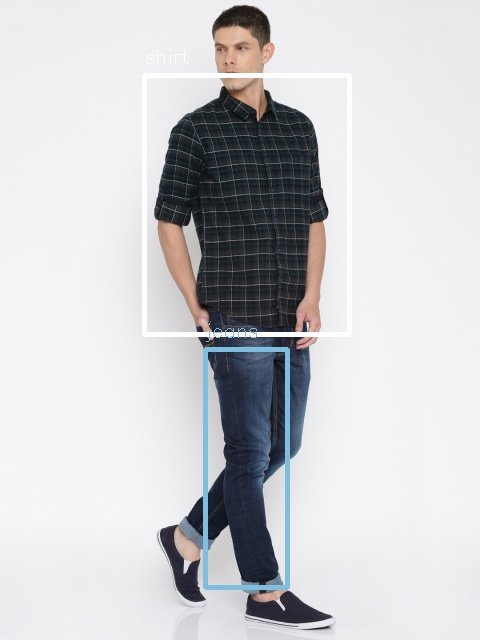

## Apparel Detection System using Darkflow 

I have used Darkflow for this project. [Link to Original repo](https://github.com/thtrieu/darkflow).

Output example:



## Dependencies

Python3, tensorflow >= 1.0, numpy, OpenCV 3.

### Getting started

You can choose _one_ of the following three ways to get started with darkflow.

1. Just build the Cython extensions in place. NOTE: If installing this way you will have to use `./flow` in the cloned darkflow directory instead of `flow` as darkflow is not installed globally.
    ```
    python3 setup.py build_ext --inplace
    ```

2. Let pip install darkflow globally in dev mode (still globally accessible, but changes to the code immediately take effect)
    ```
    pip install -e .
    ```

3. Install with pip globally
    ```
    pip install .
    ```

## Parsing the annotations

Skip this if you are not training or fine-tuning anything (you simply want to forward flow a trained net)

For example, if you want to work with only 2 classes `shirt`, `jeans`; edit `labels.txt` as follows

```
shirt
jeans
```

And that's it. `darkflow` will take care of the rest.

## Annotate training images

I used [LabelImg](https://github.com/tzutalin/labelImg) to annotate my input data. After annotating the data, keep training images in `./train_images` folder and annotation file (`.xml`) in `./annotations` folder

## Flowing the graph using `flow`

```bash
# Have a look at its options
flow --h
```

## Training the model

The configuration file `tiny-yolo-2c.cfg` is in `/cfg` folder. I used 15 images to train the model.

I trained the model for 100 epoch with ADAM Optimizer, learning rate 1e-4 and batch size 15. I used pre-trained tiny-yolo weights. [Download link.](https://pjreddie.com/media/files/tiny-yolo.weights)

### Train using `.weights` file

```bash
## Training using pre-trained weights
flow --train --model cfg/tiny-yolo-2c.cfg --load tiny-yolo.weights --trainer adam --dataset train_images/ 
 --annotation annotations/ --batch 2 --epoch 100 --lr 1e-4
```

### Train from start 

```bash
## Training from start
flow --train --model cfg/tiny-yolo-2c.cfg --trainer adam --dataset train_images/ 
 --annotation annotations/ --batch 2 --epoch 100 --lr 1e-4
```

### Train using checkpoint in `./ckpt` folder, for e.g 100

```bash
## Training using previious checkpoint
flow --train --model cfg/tiny-yolo-2c.cfg --load 100 --trainer adam --dataset train_images/ 
 --annotation annotations/ --batch 2 --epoch 100 --lr 1e-4
```

## Testing the model

There are two ways to test the model. Using last checkpoint or using `.pb` file. I used 5 test images, which are located in `test_images` folder. 

### Test using checkpoint in `./ckpt` folder

```bash
flow --model cfg/yolo-new.cfg --load 1500 --imgdir test_images/
```

### Test using protobuf file (`.pb`)  

For this, we first need save the built graph to protobuf file (`.pb`)

#### Save the built graph to a protobuf file (`.pb`)

```bash
## Saving the lastest checkpoint to protobuf file
flow --model cfg/tiny-yolo-2c.cfg --load 100 --savepb

## Saving graph and weights to protobuf file
flow --model cfg/tiny-yolo-2c.cfg --load bin/tiny-yolo.weights --savepb
```
When saving the `.pb` file, a `.meta` file will also be generated alongside it. This `.meta` file is a JSON dump of everything in the `meta` dictionary that contains information nessecary for post-processing such as `anchors` and `labels`. This way, everything you need to make predictions from the graph and do post processing is contained in those two files - no need to have the `.cfg` or any labels file tagging along.

#### Test using `.pb` file. 

Darkflow supports loading from a `.pb` and `.meta` file for generating predictions (instead of loading from a `.cfg` and checkpoint or `.weights`).

Please download `.pb` and `.meta` file from these links: [.pb file](https://drive.google.com/open?id=0B4VkcIqPPLbUR3RoTlRqMmZvQzQ) and [.meta file](https://drive.google.com/open?id=0B4VkcIqPPLbUcWdVQVFiaHVaM2c). Keep these files in `./built_graph` folder.

```bash
## Forward images in test_images for predictions based on protobuf file
flow --pbLoad built_graph/tiny-yolo-2c.pb --metaLoad built_graph/tiny-yolo-2c.meta --imgdir test_images/
```

Output images will in `./out` folder within `./test_images` folder.

Lastly, If you want to train or test using my latest checkpoint. Please check out this [drive folder](https://drive.google.com/open?id=0B4VkcIqPPLbUQy1JTGdXS1ZuVlE). Download and keep these files in `./ckpt` folder. 

That's all.

Thank you!